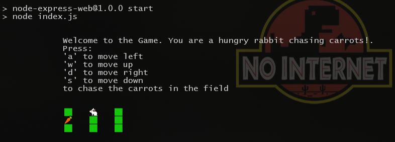
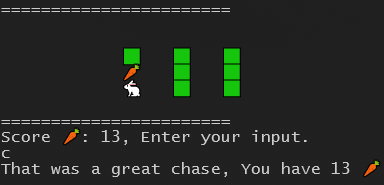

# A simple terminal game
## A simple game where you are a Rabbit chasing carrots
- Clone the repository.
- Open a terminal, change the current working directory to the project's root directory.
- Run the command `npm run start` to start the game.
- Follow the instructions to play the game.
### Screenshots:

